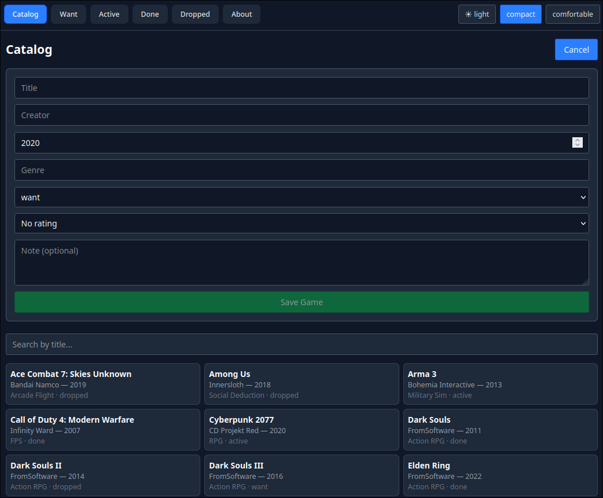
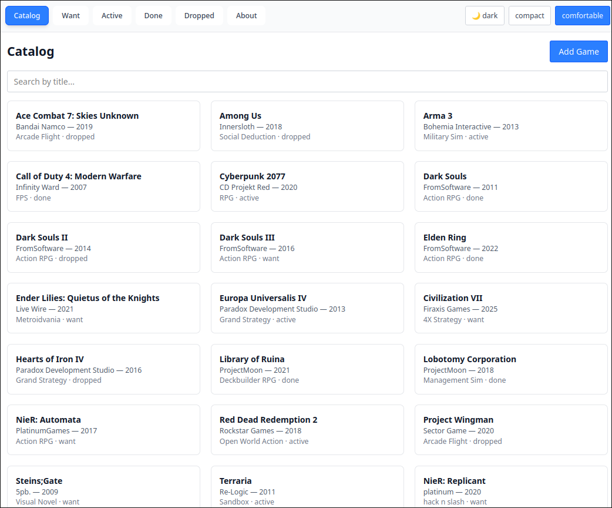

# GameVault Project

## About
GameVault is a personal tracker for your video games. You can add games
you want to play, are currently playing, have finished, or gave up on;
and keep notes and ratings for each one. <br>
Browse the full catalog, filter by status, and search by title. Open any
game to change its status, jot down a note, or rate it from 1 to 5.<br>
You can switch between light and dark themes and toggle between compact
and comfortable density as both preferences are saved and persist across
reloads.<br>

## Screenshots




## Setup
### Installation
1. Clone the repository and install dependencies:
```bash
   npm install
```

### Running
This project needs **two terminals** running at the same time:

1. Start the json-server backend (port 3001):
```bash
   npm run server
```
2. In a second terminal, start the Vite dev server (port 5173):
```bash
   npm run dev
```
3. Open http://localhost:5173 in your browser.

### Resetting
To restore the original seed data:
```bash
npm run reset-db
```
